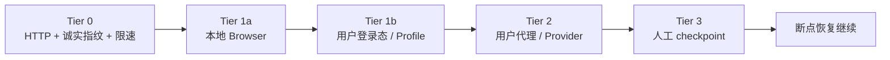

# Phase 1 工程笔记：开工前的决策与建议

更新日期：2026-08-17
前置文档：[PRODUCT_PLAN_V2.md](PRODUCT_PLAN_V2.md)
本文把四份调研（competitors C01-C10、pains P01-P10、round2 反证 R01-R06、batch market B01-B10）中与爬虫工具直接相关的发现，转成开工前要锁定的工程决策。

---

## 1. 开工前锁定的三个决策

### 决策一：benchmark 先于爬虫，且必须有 ground truth

V2 计划把 benchmark 放在最后四周，这是顺序错误。测试集 + 打分脚本应该是**写的第一段代码**，因为它同时是三样东西：

1. **开发反馈回路**——每个 feature 合入的标准是"移动了哪个指标"，而不是"写完了"；
2. **营销资产**——落地页的核心内容就是这份对比数据；
3. **终止条件的测量仪**——V2 §6 的继续/终止门槛需要它才能执行。

#### 两层测试集（没有 ground truth 的指标等于主观评分）

**第一层：固定 fixture，30-50 个，本地 HTTP server 提供，结果完全可复现。**

覆盖：静态页、SPA/客户端渲染、空页面、软阻断/挑战页、重定向链、超时、超长正文、列表页、重复内容页、软 404（200 状态的错误页）、zip bomb、畸形 HTML。

**版权约束**：仓库第一天公开，不能提交抓取的真实网站 HTML。做法是——结构模式自己合成（同时能精确编码 ground truth），需要真实内容时只用 Wikipedia/MDN（CC BY-SA）、美国政府站（公有领域）或自有站点。

**每个 fixture 的标注（ground truth）**：

- `must_contain`：必须出现在结果里的事实或文本片段
- `must_not_contain`：禁止进入结果的导航、页脚、cookie banner、广告
- `expected_lane`：应该走 HTTP 还是 browser
- `empty_is_legit`：空结果是否合理
- `budget`：允许的最大 token、耗时、重试次数
- `expected_main_tokens`：主内容 token 数的期望范围

**第二层：线上 canary，先 20-30 个，稳定后扩到 100。** 衡量真实世界成功率，**不作为回归测试**（线上会漂移，回归必须跑 fixture）。canary 只提交 URL + 标注 + 内容 hash，不提交内容本身。

#### 假成功率的操作化定义

这是主打指标，所以不能靠人工判断。定义为：结果 status=success 且命中以下任一项：

1. `must_contain` 标注的事实缺失
2. 输出中挑战页特征文本（"Just a moment"、"Enable JavaScript and cookies"、"Access denied"、"Are you a robot"）占比超阈值——即把拦截页当正文返回
3. 主内容 token 数低于 `expected_main_tokens` 下界，或 `must_not_contain` 的 boilerplate 出现
4. 返回内容匹配另一个 URL 的标注（重定向到首页/登录页、软 404）
5. 内容相对标注全文被截断，但没有置 `truncated_at`

`false_success_rate = 命中≥1项的 success 数 / 全部 success 数`。

第 2、4、5 项在线上 canary 上无需标注即可判定。软 404 的检测办法：同域请求一个随机不存在路径，比较响应相似度。

#### 对照组（分开列，不合并打分）

裸 HTTP+Readability 基线、裸 Playwright 基线、Crawl4AI、Firecrawl 自托管、我们。

Firecrawl Cloud **单独一列**，不与自托管混。且发布前先查它的 ToS——很多 SaaS 条款禁止发布对比 benchmark；自托管版是 AGPL，测试和发布无碍。

#### fixture 服务方式与 SSRF 策略的冲突

fixture 必须经本地 HTTP server 提供，不能走 `file://`（`file://` 正是 SSRF 规则要封的，且要测的代码路径包含 HTTP 处理）。但 `127.0.0.1` 也在 SSRF 黑名单内，因此需要显式 `--allow-private-network` 逃生开关。这个开关同时也是内网爬取用户需要的那个——一个机制服务两个场景。

### 决策二：技术栈——TypeScript monorepo，Playwright 直用，不基于 Crawlee

- **语言**：TypeScript。理由：Playwright 原生 TS；MCP 生态 TS 优先；CLI/API/SDK 同仓复用。Python 用户通过 REST + 薄封装 SDK 服务（1b 交付）。
- **不基于 Crawlee 构建**（修正 research 文档阶段 0 的建议）：Crawlee 的队列、存储、autoscaling 抽象会与我们的 SQLite task/attempt/step 模型冲突，而**执行循环正是我们差异化（trace、成本、失败分类）所在的层**，必须自己拥有。Crawlee 是 Apify 的漏斗，深度依赖它等于把架构绑在最直接竞争者的路线图上。"不重写浏览器引擎"的原则不变——Playwright 就是浏览器引擎，我们不碰它以下的东西。
- 具体选型：
  - HTTP lane：`undici`（原生、快、可控超时）
  - 解析：`cheerio` + `@mozilla/readability`（主内容提取）+ `turndown`（Markdown 转换）——三者都是成熟库，正文清洗不自研算法，先调参
  - Token 计数：`tiktoken`（wasm 版）
  - 存储：`better-sqlite3`（同步 API，checkpoint 写入简单可靠）
  - API：`hono`（轻，可同时跑 node/bun）
  - CLI：`commander` 或 `citty`，输出走同一 trace 格式

### 决策三：License——服务端 AGPL-3.0，SDK/客户端 MIT

**AGPL 的作用是保证"修改 + 网络部署"保持开放，不是阻止托管转售。** AGPL 要求向网络用户提供对应源码，但任何人合规履行后都可以提供托管服务。真正能阻止转售的是 BSL/SSPL 类 source-available 条款、双许可 + CLA，或商标限制——前两者不再属于严格开源。

三点澄清：

- **实际护城河是商标，不是 license。** Grafana、Plausible 都是这个结构：代码可 fork，名字不可用。这是唯一便宜且真实有效的保护 → 名字要尽早注册（见 §5）。
- AGPL 的**威慢作用真实但性质是政策性的**：大量公司内部合规禁止引入 AGPL 依赖。这个效果值得要，但不能对外描述成"法律上禁止转售"。
- **CLA vs DCO 是单向门。** CLA 保留将来改双许可/BSL 的可能；DCO 不保留（之后改 license 需逐个联系贡献者）。倾向 **DCO**——本产品差异化不建立在 license 闸门上，最大风险是没人用。这是商业选择权问题，在合入第一个外部 PR 之前定即可，不阻塞第 0 周。

SDK 和 MCP server 用 MIT 保证集成无摩擦。

---

## 2. 痛点研究 → 六条硬性设计规则

这是 P01-P10 的直接转化，每条都是"第一天做很便宜、事后补很痛苦"的类型：

| # | 规则 | 来源痛点 |
| --- | --- | --- |
| 1 | **任何 I/O 调用都有 deadline。** 每个 CDP 调用、每次 fetch、每个解析步骤都包在超时里；任务级 watchdog + 总预算硬停。禁止任何可能无限挂起的 await | P03（CDP 调用无限挂起占着付费浏览器）、P09（40 分钟循环） |
| 2 | **空结果是一等失败类型。** 输出契约区分 `success`、`empty_legit`（页面本来就没内容，附证据）、`empty_suspicious`（疑似渲染/提取失败，附截图+DOM 快照）。绝不静默返回空 Markdown | P02（空 results.md 无法归因）、R 系列的假成功抱怨 |
| 3 | **Session/context 生命周期显式化。** 每个任务声明 `context: fresh \| reuse`，默认 fresh（Playwright 的 browser context 很便宜）；复用必须带健康探针。避免状态污染导致"第二个任务失败" | P01（多任务复用浏览器第二个就挂）、P04（跨标签丢 session） |
| 4 | **循环检测进 crawl 核心。** URL 规范化去重 + 内容 hash 去重 + 相同 DOM 指纹连续出现 N 次即硬停并报 `loop_detected`。"一直在跑"不能被当作正常状态 | P09（同一 modal 重开 11 次）、原 Phase 1 清单里有但没定义机制 |
| 5 | **每个结果自带成本行。** duration、lane、重试次数、token 数、（托管时）浏览器秒数和代理流量。批量任务跑之前给预估，跑完给 cost per successful page | P05（token 翻倍无感知）、R01（1 分钟计费下限放大短任务成本）、B10（credits 计量焦虑） |
| 6 | **阻断处理走执行阶梯，不是报错了事。** 识别失败原因 → 自动选择下一条路径 → 从断点恢复。核心仓库不含 CAPTCHA 破解和指纹伪造，但阶梯本身完整开源、无付费闸门。详见 §2.5 | P09/P10、C 系列显示反爬是竞品的计费分层项 |

---

## 2.5 反爬执行阶梯（规则 6 展开）

### 阶梯



差异化不是"告诉用户失败了"，而是**识别原因 → 自动路由到下一级 → 从中断位置恢复**。每次升级的原因、代价和结果都落库（与 §4.1 通道升级语料同一张表）。

### 各级内容

**Tier 0 — 不被误伤（自研，收益最大成本最低）**

正当爬虫被封，多数原因不是指纹而是请求模式：header 一致性（UA/Accept-Language/平台信息与实际 Chromium 版本匹配——这不是伪装，不一致才是 bug）、按域名并发上限与间隔、指数退避、遵守 `Retry-After`、任务内 cookie 持久、robots.txt 感知（可 opt-out 但记入 trace）。调研 R02/R03 中"跑一阵就开始坏"多数出在这层。

**Tier 1a — 本地 Playwright Chromium**（真实浏览器，非模拟）

**Tier 1b — 用户登录态**：`storageState` 持久化 + **human handoff 登录**（打开真实窗口让用户自己登录、自己过验证码，捕获并复用 session）。用户在这些站本就有访问权，路径完全正当。调研 B04/B06 显示"高质量目录都在登录后、30%+ 有 bot protection"——这条路径覆盖面比直觉大。**建议提前到 Phase 1**，实现成本仅为持久化 storageState。

**Tier 2 — 用户自带出口**：BYO 住宅代理（按 GB 计费，比买 Browserbase 便宜得多，**性价比最高的一级且我们支持成本接近零**）或 Provider Adapter（Browserbase $20/月起、Steel $0+usage、Zyte $0.06/1k、ScrapingBee $19.99/月起——均为 C 系列调研已核实定价）。我们提供 adapter 接口 + 成本核算 + 成功率归因；能力与合规责任由 provider 承担。

**Tier 3 — 人工 checkpoint**：分类上报（`cloudflare_challenge` / `captcha` / `rate_limit` / `login_wall`）+ 保留证据 + 安全移交浏览器状态 + 处理后断点续跑。

### 能力上限：必须诚实的部分

面对 Cloudflare Enterprise 级 bot management，本地阶梯的终点是**用户自带的凭据或出口**。在不用登录态、不用住宅 IP、不做指纹伪造的前提下进入，没有技术路径——这不是工程投入问题。

因此阶梯在**架构上**完整（每级都在开源仓库、可自动路由、可恢复），但最硬的档位必然依赖用户带东西进来。Provider 是可选增强器而非必要条件——因为 Tier 1b 和 Tier 2 的 BYO 代理都是免费路径。

### 对外 claim 的边界

**不能说**："我们解决反爬"。

**可以说**：能过掉 naive 爬虫栽跟头的那一档（长尾里的大多数）；更硬的档位把升级路径自动化且不设付费闸门。

对比 Firecrawl 的落点不是"我们 stealth 更强"，而是"fire-engine 是绑死的黑盒、只在云上、看不到成本也搬不走；我们这层开放可换"。

### 预注册假设（第 0 周写死阈值，先于数据）

Tier 0+1（诚实 header + 限速 + 本地浏览器 + 用户登录态）在长尾 canary 集上的成功率：

- **≥80%** → 定位成立，"多数场景无需购买反爬能力"可作为对外主张
- **60-80%** → 主张需限定场景表述
- **<60%** → 主张为假，营销必须改写

### 为什么不自研 stealth

打不赢：Browserbase 融资 $67.5M、估值 $300M，$3M+ 收入全靠这个能力；Steel 靠多 provider 路由自报 ~93%。这是全职基础设施生意。且它是维护跑步机（Cloudflare 每更新一次就得修），会吃掉本应投给可观测/context/workflow 的预算。此外公开仓库含破解代码会阻断企业采用（企业客户是后期唯一高 LTV 来源），并留下法律敞口——绕过技术访问控制与抓取公开数据是不同性质的问题。C 系列显示全行业把反爬当收费闸门分层售卖，意味着"免费且更强"这个位置在经济上不存在。

### 把诚实变成武器：benchmark 分段公布

- **合作型站点**（静态/文档/列表/弱阻断）：完整对比数据——这段我们能赢，且是多数 RAG/Agent 场景的真实构成
- **受保护站点**：明确标注裸装成功率，并给出接各 provider 后的每成功页成本

没有竞品公布分段数据（全给混合后的漂亮数字）。分段 + 每 provider 成本对用户更有用，且直接强化"成本透明"主张。

---

## 2.6 安全契约（第一天写，不是后补）

### SSRF 防护

- 按**解析后的 IP** 判断，不是 hostname
- resolve 后 **pin 住 IP 再连接**，防 DNS rebinding
- 封禁：私有网段、loopback、link-local、**IPv6 映射地址**（`::ffff:127.0.0.1`）、`file://` 及非 http(s) scheme
- 云 metadata：`169.254.169.254`、`metadata.google.internal`、`100.100.100.200`（阿里云）
- **每一跳重定向重新校验**，不只校验初始 URL
- 逃生口：`--allow-private-network`（同时服务内网爬取用户和 fixture 本地 server）

**浏览器 lane 的 SSRF 明显更难**：Chromium 自己做 DNS、自己跟重定向，且页面会发起未主动请求的子资源，应用层检查拦不住。两条路：CDP `Fetch.enable` 逐请求拦截校验，或把 Chromium 放进网络隔离容器做 egress 过滤（更可靠）。这是真实工程量，需单独排期。

### 取消传播

- 统一 `AbortSignal` 贯穿 undici 和 Playwright，**不能只用 `Promise.race` 做 timeout**（底层请求和 Chrome 进程会继续跑）
- CDP 挂死时的兜底：按 PID 硬杀
- 启动时回收上次遗留的孤儿 Chromium 进程

### 资源上限（全部第一天设默认值）

最大响应体积、最大重定向次数、**解压后大小上限**（zip bomb）、浏览器进程回收检查、crawl 的页数/时间/成本三重预算、API 层并发与域名级限速。

---

## 3. 修正后的前四周构建顺序

```
第 0 周：benchmark harness（验收标准见下）
  30 个 fixture（含 ground truth 标注）+ 20 个线上 canary
  + 一键运行的评分系统 + 对照组基线跑分
第 1-2 周：HTTP lane 端到端
  undici 抓取 → readability/turndown 管线 → 失败分类 + 空结果三分类
  → SQLite task/attempt/step 落库 → CLI 输出带 trace
  → SSRF 防护 + 取消传播 + 资源上限（§2.6，与功能同步不后补）
  验收：fixture 静态组正确率达门槛；假成功率可自动计算
第 3-4 周：browser lane + 升级阶梯
  Playwright lane → Tier 0 诚实指纹/限速 → HTTP→browser 自动升级（原因落库）
  → Tier 1b storageState + human handoff 登录
  → deadline/watchdog 全覆盖 → 浏览器 lane 的 SSRF 方案
  验收：fixture SPA 组可量化；升级决策可查、命中率可统计；预注册假设（§2.5）出首轮数据
```

crawl（多页）、resume、Provider Adapter、REST API 按 V2 原计划落在 5-8 周，不变。

### 第 0 周验收标准

不以"项目初始化完成"为结果。必须达到：

1. 一条命令运行全部 benchmark
2. 测试集有版本、日期、配置和 ground truth 标注
3. 结果同时输出 JSON、Markdown 和原始 artifact
4. 能区分 `success / partial / empty_verified / blocked / failed / cancelled / budget_exceeded`
5. 每项结果带 evidence、trace 和资源消耗
6. 所有超时都能真正取消，跑完无遗留 Chromium 进程
7. 固定 fixture 正确率达预设门槛（如 95%）
8. 假成功率按 §2.5 的五项规则自动计算，无人工判断
9. 每次运行保存机器、网络、依赖版本和 git commit
10. 不用综合总分掩盖差异——公开每个原始指标

---

## 4. Schema 的纸面验证（不写代码，防止日后返工）

task/attempt/step 三层模型定稿前，用 batch market 研究（B 系列）的状态清单在纸面上过一遍：未来分支需要的状态包括 `queued / ready / needs_login / needs_user_review / submitted / awaiting_approval / approved / live / indexed / failed / retry`（B04/B09 的队列语义）以及提交回执、截图证据、幂等键、7/30 天复查（B02 的"提交后不知道活没活"痛点）。

验证问题只有一个：**这些状态能否作为 step 的 status 枚举 + artifact 表的行放进现有 schema，而不需要加表或改主键？** 能，schema 定稿；不能，现在改。Phase 1 不实现任何提交功能——这只是确保"分支复用树根 schema"的承诺不是空话。

---

## 5. 分发建议（工程之外，但决定树根能不能活）

1. **README 的 hero 不是功能列表，是一次失败的 trace 输出**——"这个页面为什么失败、走了哪条 lane、花了多少钱"的真实终端截图。所有竞品的 README 都在展示成功；展示失败解释是最快的差异化信号。
2. **MCP server 第 9-12 周如期交付，别推迟**——调研里 n8n/Cursor/MCP 用户是明确的目标画像（research §7 第 3 周），MCP 是这批人发现工具的渠道。
3. **发布渠道用自己的调研结论**：r/LocalLLaMA 和 r/n8n 是两个已核验存在真实需求讨论的社区（研究里那两个 Reddit 帖就在这两个 sub）；发布内容直接回应那两个帖子的痛点（可见性、credits 过期、自托管差异）。
4. **Dogfood：用自己的爬虫跑自己的市场监控**——把 evidence_ledger 里的竞品定价页做成一个定时 crawl 任务，价格变动自动更新调研。既是真实使用场景，又持续产出内容素材。
5. **起名前查 npm/PyPI/GitHub/商标冲突**，域名和 npm 包名同时拿下再公开。

---

## 6. 明确不做清单（Phase 1 范围守卫，来自全部调研）

- 不自研 stealth / CAPTCHA 破解 / 指纹伪造（§2.5；但执行阶梯 Tier 0-3 完整实现，Tier 1b 登录态提前到 Phase 1）
- 不做 session 池（V2 已定，C05/R01 证明这是 Steel/Browserbase 的主业）
- 不做表单提交/目录提交的任何代码（B 系列是 Phase 2 假设，只做 §4 的纸面 schema 验证）
- 不做语义压缩（V2 §4.4）
- 不追 Firecrawl 新 endpoint（V2 §4.6）
- 不基于 Crawlee（决策二）
