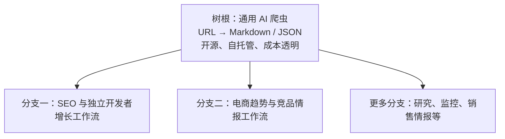
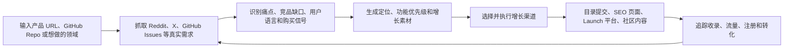
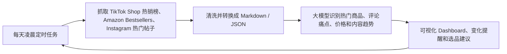

# 产品战略：树根与工作流分支

更新日期：2026-08-18

市场验证记录：[research/market_validation_root_branch_model.md](research/market_validation_root_branch_model.md)

## 1. 核心判断

产品采用“树根 + 分支”的结构：

- **树根**：通用 AI 爬虫，是产品的技术核心、开源入口、开发者生态和信任来源。
- **分支**：建立在爬虫之上的垂直自动化工作流。每条分支对应一个明确行业、任务闭环和付费场景。
- **树根负责获取和标准化数据，分支负责把数据转化成业务结果。**

第一阶段只完成树根，不同时开发多个垂直产品。第二阶段优先开发 SEO 工作流分支；更后期可以扩展电商情报等分支。

## 2. 树根：通用 AI 爬虫

### 定位

一个开源、轻量、成本透明的 Web-to-LLM 基础设施。输入网页或网站，稳定输出适合大模型消费的 Markdown、JSON、链接、元数据和证据。

### 第一阶段范围

- 单页抓取 `scrape`；
- 网站抓取 `crawl`；
- URL 发现 `map`；
- HTTP、JavaScript 浏览器、本地 Chrome/CDP、持久 Session 等多通道执行；
- 正文清洗、去噪、去重和结构化；
- Markdown、JSON、HTML、links 和 metadata 输出；
- token 预算、chunking 和 Context 压缩；
- 阻断、空内容、超时和循环检测；
- checkpoint、重试、断点续跑和失败解释；
- REST API、CLI、TypeScript/Python SDK、MCP；
- BYO proxy、BYO browser provider 和本地优先运行。

### 开源与收费边界

- 核心代码完全开源；
- 自托管和本地运行免费；
- 用户可使用自己的 Chrome、代理和第三方 Provider；
- 不采用难以预测的隐藏 credit multiplier；
- 后期托管服务可以按浏览器、代理、存储和任务成本透明收费；
- 工作流分支中的可视化、调度、监控、团队协作和托管执行是主要付费空间。

## 3. 分支一：SEO 与独立开发者增长工作流

### 目标用户

优先服务独立开发者、micro-SaaS 创始人和小型增长团队，而不是把产品定位成单纯的 SEO 外链工具。

### 用户任务

用户输入产品 URL、GitHub Repo 或想做的领域。系统从公开用户讨论和产品信号中发现需求，生成定位与增长资产，执行选定渠道，并追踪最终结果。

### 工作流模块

1. **输入与知识库**
   - 产品 URL、Repo、产品描述、ICP、品牌素材和账号授权；
   - 形成可复用的 canonical product profile。

2. **需求和竞品抓取**
   - Reddit、X、GitHub Issues、论坛、评论和竞品页面；
   - 输出带来源的用户原话、痛点频率、强度、替代方案和购买信号。

3. **Growth Pack**
   - 产品定位和首页文案；
   - 功能优先级；
   - SEO 主题、对比页和 Alternative 页面；
   - 目录描述、Launch 文案和社区内容草稿。

4. **分发执行**
   - 发现并筛选相关目录和发布渠道；
   - 批量生成适配不同字段的提交资料；
   - 在用户授权后执行表单、上传、验证和人工接管；
   - 单站失败不阻塞整个 Campaign，处理后可以续跑。

5. **结果追踪**
   - submitted、approved、live、indexed、owned、reverified；
   - referral traffic、注册和转化；
   - 7/30 天复查、失效检测和资料更新；
   - 将真实结果重新反馈给痛点和渠道评分。

### SEO 分支的付费点

- 可视化工作流编辑器；
- 定时运行和批量 Campaign；
- 托管浏览器、Session、代理路由和任务恢复；
- 目录/渠道数据库及持续更新；
- 登录、CAPTCHA 或未知字段的 Human Handoff；
- 审批、上线、索引和链接存活监控；
- 流量、注册与转化归因；
- 多产品、多客户、团队权限和白标报告；
- 高价值 Workflow/Recipe Marketplace。

SEO 分支销售的不是“抓了多少网页”或“提交了多少目录”，而是一个可验证的增长任务是否完成以及带来了什么结果。

## 4. 分支二示例：电商趋势与竞品情报

该分支暂不进入第一阶段开发，只用于验证树根的可扩展性。

### 示例工作流

### 潜在付费点

- 定时调度；
- 多平台 Connector；
- 历史数据与变化检测；
- 商品、价格、评论和内容趋势可视化；
- 异常提醒；
- 团队共享和导出；
- 托管运行与更高频率。

## 5. 产品阶段

### 第一阶段：只完成树根

交付轻量版 Firecrawl 的核心使用路径：URL → 稳定抓取 → 干净 Markdown/JSON → 直接进入 LLM、RAG 或 Agent。

目标是 GitHub 采用、开发者信任、生态集成和真实抓取基准，不开发完整的增长工作流。

### 第二阶段：SEO 工作流分支

基于通用爬虫增加 Pain Mining、Growth Pack、渠道选择、目录/Launch 提交和结果追踪，并以可视化工作流、自动化和托管执行形成付费层。

### 第三阶段及以后：复制分支模型

复用同一树根和 Workflow Runtime，进入电商情报、竞品监控、销售研究等场景。每个新分支都必须满足：

- 有重复出现且足够痛的任务；
- 抓取的数据能被转成明确决策或动作；
- 可以形成定时、监控、协作或托管执行的付费闭环；
- 不需要重写底层爬虫，只需要新的 Connector、Recipe、数据模型和 UI。

## 6. 不变的产品原则

1. 通用爬虫始终是核心，不让任何一个垂直分支绑死底层架构。
2. 开源树根负责流量、生态和信任；付费分支负责自动化、可视化和业务结果。
3. SEO 是第一条分支，不是整个公司的永久品类定义。
4. 每条分支必须从“抓取数据”继续走到“执行动作”和“追踪结果”。
5. 先证明树根可靠和好用，再扩展工作流；第一阶段不同时做多个分支。
6. 所有工作流共享任务状态、证据、成本、Checkpoint、Handoff 和结果验证能力。
